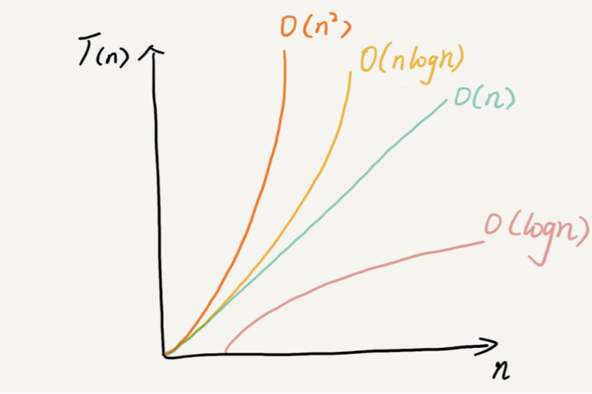

##  基础概念

> 数据结构是为算法服务的，算法要作用在特定的数据结构之上。数据结构是静态的，它只是组织数据的一种方式。如果不在它的基础上操作、构建算法，孤立存在的数据结构就是没用的。
>
> 因此，我们无法孤立数据结构来讲算法，也无法孤立算法来讲数据结构。比如，因为数组具有随机访问的特点，常用的二分查找算法需要用数组来存储数据。但如果 我们选择链表这种数据结构，二分查找算法就无法工作了，因为链表并不支持随机访问。

##  复杂度分析

> 复杂度分析是整个算法学习的精髓，只要掌握了它，数据结构和算法的内容基本上就掌握了一半。

> 加法法则：总复杂度等于量级最大的那段代码的复杂度
>
> 乘法法则：嵌套代码的复杂度等于嵌套内外代码复杂度的乘积

> O(1)、O(logn)、O(n)、O(nlogn)、O(n 2 )
>
> 

## 数据结构

#### 数组

> 概念：数组（Array）是一种线性表数据结构。它用一组连续的内存空间，来存储一组具有相同类型 的数据。（除了数组，链表、队列、栈等也是线性表结 构。）
>
> 特性：随机访问，根据下标随机访问的时间复杂度为 O(1)。

>插入优化：在一个位置插入元素，如果不要求顺序，则直接替换原位置元素（原数扔到数组末尾）
>
>删除优化：每次的删除操作并不是真正地搬移数据，只是记录数据已经被删除。当数组没有更多空间存 储数据时，我们再触发执行一次真正的删除操作。（**JVM 标记清除垃圾回收算法**）

> VS ArrayList容器：
>
> 数组可以存储基本类型，ArrayList则会自动装箱拆箱有一定性能损耗，业务开发可以直接用ArrayList，支持动态扩容，api完善，封装了数组操作细节，追求性能的网络框架可能会用数组。

> 为何下标从0开始：下标是数组内存地址偏移量

#### 链表

> 单链表  ：尾节点指向null
>
> 循环链表 ：尾结点指针是指向链表的头结点，环形结构
>
> 双向链表：每个结点不止有一个后继指针 next 指向后面的结点，还有一个前驱指针 prev 指向前面的结点
>
> 双向循环链表（LinkedHashMap）：在链表的某个指定结点前面插入一个结点，双向链表比单链表有很大的 优势。双向链表可以在 O(1) 时间复杂度搞定，而单向链表需要 O(n) 的时间复杂度。对于一个有序链表，双向链表的按值查询的效率也要比单 链表高一些。因为，我们可以记录上次查找的位置 p，每次查询时，根据要查找的值与 p 的大小关系，决定是往前还是往后查找，所以平均只需要查找一半的数据。

> Vs 数组
>
> 链表通过指将一组零散的内存块串 联起来使用，无需连续的存储空间。数组简单易用，在实现上使用的是连续的内存空间，可以借助 CPU 的缓存机制，预读数组 中的数据，所以访问效率更高。而链表在内存中并不是连续存储，所以对 CPU 缓存不友 好，没办法有效预读。
>
> 数组的缺点是大小固定，一经声明就要占用整块连续内存空间。如果声明的数组过大，系统 可能没有足够的连续内存空间分配给它，导致“内存不足（out of memory）”，如果你的代码对内存的使用非常苛刻，那数组就更适合你。因为链表中的每个结 点都需要消耗额外的存储空间去存储一份指向下一个结点的指针，所以内存消耗会翻倍。而 且，对链表进行频繁的插入、删除操作，还会导致频繁的内存申请和释放，容易造成内存碎 片，如果是 Java 语言，就有可能会导致频繁的 GC（Garbage Collection，垃圾回收）。
>
> 链表本身没有大小的限制，天然地支持动态扩容，这也是它与数组最大的区别。

> Exercise（**写链表是最考察验逻辑思维能力的。链表代码到处都是指针的操作、边界条件的处理，可以看出一个人写代码是否 够细心，考虑问题是否全面，思维是否缜密**）:
> 单链表反转|链表中环的检测|两个有序的链表合并|删除链表倒数第 n 个结点|求链表的中间结点
>
> 举例画图法：找一个具体的例子，把它画在纸上，释放一些脑容量，留更多的给逻辑思考

#### 栈

> VS数组|链表: 
>
> 栈可以用数组（顺序栈）|链表（链式栈）实现，是对细节的进一步封装，在特定场景（只涉及在一端插入和删除数据，并且满足后进先出、先进后出的特性）下比较适合用。
>
> 尽管数组|链表可以取代栈，但是他们暴露了太多接口，不可控。

> 场景：
>
> 操作系统分配给线程的栈 
>
> 表达式求值的编译原理（操作数栈+运算符栈）
>
> 括号匹配
>
> 浏览器前进后退（两个栈，后退的地址放入另一个栈）

#### 队列

> 实现：基于数组（顺序队列） | 链表（链式队列）实现。
>
> 原理： head指针+tail指针（指针在java中即是引用）
>
> 基于链表可以实现支持无限排队的无界队列（unbounded queue）
>
> 基于数组实现的有界队列（bounded queue）
>
> 并发队列：cas操作（入队前获取tail位置，入队的时候比较是否发生变化）

## 算法

#### 递归

> 满足下面条件即可使用递归：
>
> - 一个问题的解可以分解为几个子问题的解
> - 这个问题与分解之后的子问题，除了数据规模不同，求解思路完全一样
> - 存在递归终止条件

