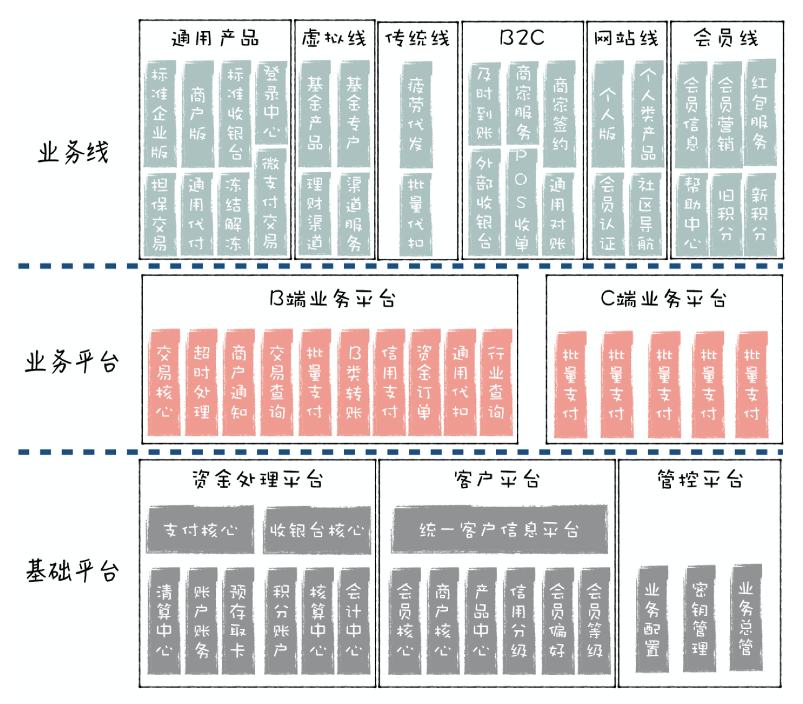
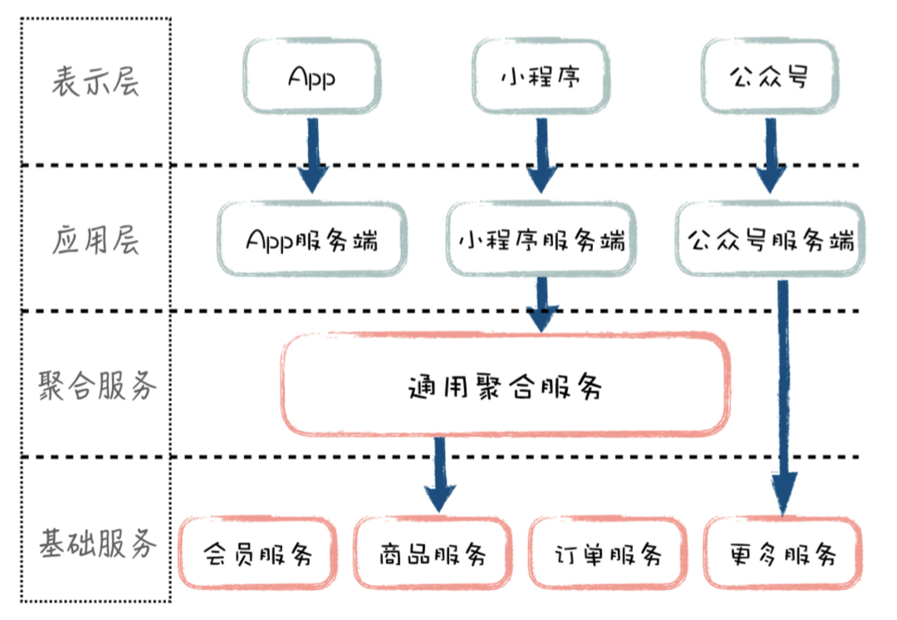
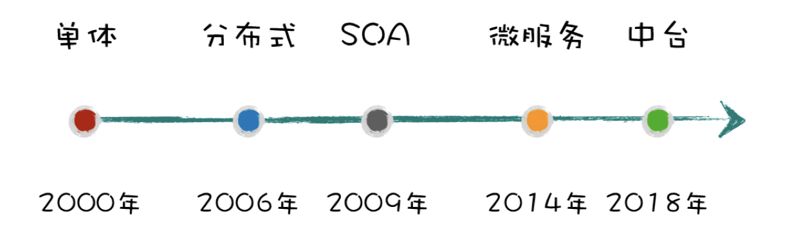
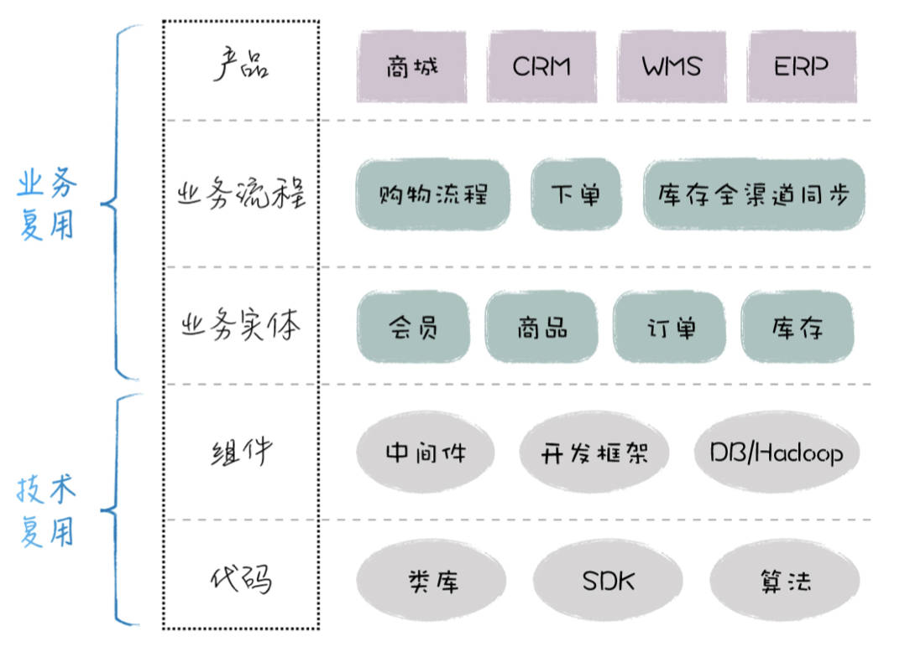
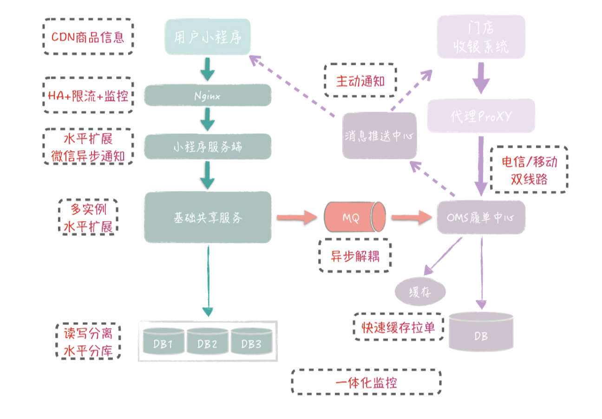
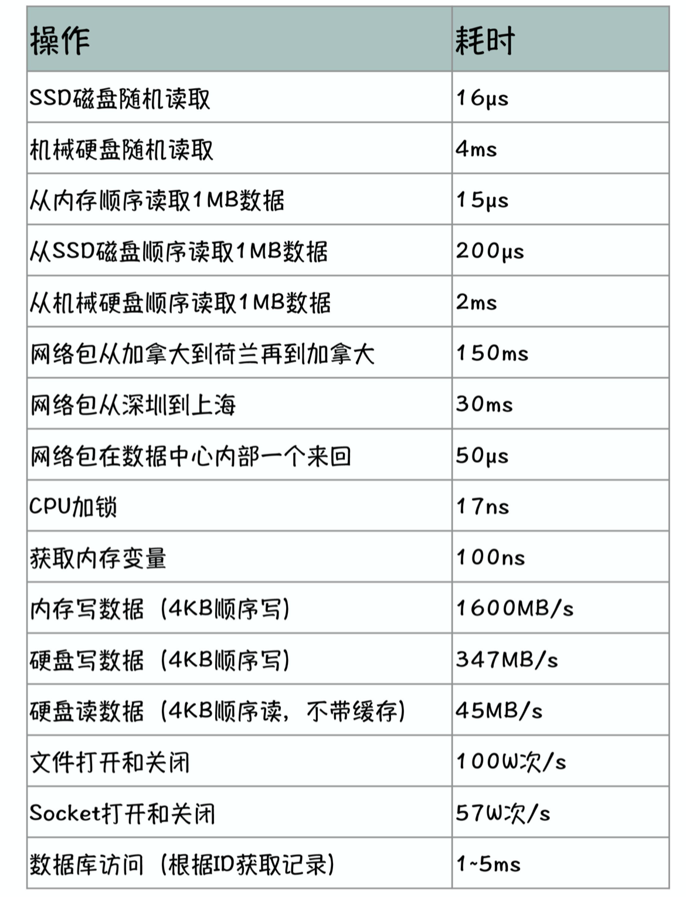

### 架构的道

物理学中有个很著名的“熵增定律”：一个封闭系统，都是从有序到无序，也就是它的熵 （即混乱程度）会不断地增加，最终系统会彻底变得无序。自然界中的生物可以通过和外界交互，主动进行新陈代谢，制造“负熵”，也就是降 低混乱程度，来保证自身的有序性，继续生存。比如，植物通过光合作用，把光能、二氧化 碳和水合成有机物，以此滋养自己，延续生命。对于软件系统，我们也可以主动地调整系统 各个部分的关系，保证系统整体的有序性，来更好地适应不断增长的业务和技术变化。这种 系统内部关系的调整就是通过架构实现的，所以，架构的本质就是：

架构实现从无序到有序，是通过合理的内部编排实现的，基本的手段，就 是“分”与“合”，先把系统打散，然后将它们重新组合，形成更合理的关系。这个分与合的过程将系统的复杂性分解为两个层次：

首先，各个子系统承担独立的职责，内部包含了自身的复杂性。子系统的复杂性对外部 是透明的，外部不用关心。其次，子系统通过封装后，简化为职责明确的一个点，因此，我们只需要在合的过程 中，解决各个点之间的依赖关系，这样就可以定义出系统整体。

### 业务架构

- 如果按照业务流程来拆分系统模块，那么有多少业务流程，就有多少个系统模块，这 个对应关系比较直接，但实现起来很困难。

- 如果按照业务域来拆分，有多少业务领域，就有多个系统模块，流程中的业务节点按照 业务域的不同，可以划分到不同的系统模块。
- 实现模块的高复用，还需要做好业务的层次划分。我们知道，越是底层的业务，它就 相对更固定。举个例子，同样是订单业务域，对于底层订单的增删改查功能，不同类型的订 单都是一样的，但对于上层的订单生命周期管理，外卖订单和堂食订单可能就不一样。把一个业务域按照层次拆分得更细，比如，把订单 模块拆分为多个上层订单模块和一个基础订单模块，这样，基础订单模块对于所有类型的订 单，都能够提供复用。模块还要：自成体系，粒度适中。模块的业务逻辑尽量围绕自身内部数据进行处理，对外部依赖越小，模块的封装性越好，稳 定性也越强，不会随着外部模块的调整而调整。

对业务架构师来说，TA 的工作，就是把业务流程和节点打散，按照业务域的维度来 划分系统模块，并定义这些模块之间的关系，最终形成一个高度结构化的模块体系。这样， 开发人员既容易理解业务，又方便落地系统。

### 模块设计

- 对系统进行建模，系统 = 模块 + 关系

- 业务架构设计如何实现业务的**可复用**呢？首先，模块的职责定位要非常清晰。对于模块来说，在定位范围内的职责要全部涵盖到，而 不在这个范围的职责全部不要。其次，模块的数据模型和接口设计要保证通用。架构师需要归纳业务场景，通过抽象提炼， 形成通用化的设计，以此来满足多个类似场景的需求。实现模块的高复用，还需要做好业务的**层次划分**。我们知道，越是底层的业务，它就 相对更固定。举个例子，同样是订单业务域，对于底层订单的增删改查功能，不同类型的订 单都是一样的，但对于上层的订单生命周期管理，外卖订单和堂食订单可能就不一样。

- 具体**划分模块职责**的时候，要保证模块业务概念的完整性。数据上，模块 需要覆盖对应业务领域的全部数据，比如一个订单模块，它要覆盖所有渠道的订单，包括三 方平台的订单、自有商城的订单、线下门店的订单等，这些不同类型订单的数据模型和实际 数据，都由订单模块负责。功能上，模块要包含业务领域的全部功能，比如订单模块包含所有订单相关的功能，包括订 单数据的增删改查、订单业务规则校验、订单的状态和生命周期管理等。

- 模块内部由数据和业务逻辑组成，其中数据是核心，业务逻辑围绕着数据，对数据做进一步 加工，方便外部使用。业务逻辑尽量围绕自身内部数据进行处理，对外部依赖越小，模块的封装性越好，稳 定性也越强，不会随着外部模块的调整而调整。**模块的粒度**要保持适中，不能为了追求定位清晰，把粒度划分得很小，导致系统的碎片化。 比如系统早期的时候，一般我们把积分功能放到用户模块里面，不单独构建积分模块，如果 后续积分的概念越来越突出，承载的业务越来越复杂，到时候可以把积分功能分离出来，单 独成模块。你所在公司里有没有类似的肿瘤系统，它包含了太多职责，导致 系统内部结构混乱，大家都不敢对它进行调整？

- 如果不对**模块的依赖关系**做针对性设计的话，依赖关系就是一个多对多的网状结构，一个有 N 个模块的系统，理论上有 N×N 个依赖关系，如果再加一个新的模块，复杂度就变成(N+1)×(N+1)，系统的复杂度随着功能的数量指数级地上升，如果考虑依赖具有方向性，这个数字还要 加倍。我们要尽量把网状结构转化为层次结构，模块结构层次化是简化模块依赖关系的有力手段。

  所以，要简化模块的依赖关系，我们就要同时简化依赖的方向和减少依赖的数量。首先，我们希望模块之间的依赖是单向的，尽量避免相互调用，为什么单向更好呢？我们知 道业务流程是有顺序的，如果模块依赖关系越直观地体现业务流程的顺序，越能帮助人理 解，否则，我们会被双向的依赖箭头绕的晕头转向，很难通过模块之间的依赖关系还原实际 业务的处理过程。

  **MVC:**

  表示层，对应前端的模块，如 App、小程序、公众号等，属于 View 层。

  应用层，对应和前端表示层直接关联的服务端，属于 Control 层。

  聚合服务层，如果系统业务比较复杂，经常需要单独的聚合服务层负责业务流程的编排 组合，这个属于 Model 层的加强。

  基础服务层，代表最基础的业务模块管理，如订单、商品、用户等，属于实际的 Model 层。

  

- **模块拆分：**水平拆分|垂直拆分，一般做业务架构时，我们先考虑垂直拆分，从大方向上，把不同业务给区分清楚，然后再针 对具体业务，按照业务处理流程进行水平拆分。
- **模块整合：**通用化整合（改造支持更多业务）|平台化整合（更大粒度抽象）

### 架构演进

- 微服务和SOA的区别

微服务强调围绕业务，进行清晰的业务和数据边界划分，并通过良好定义的接口输出 业务能力，这和 SOA 架构里的服务有点类似。但两者不同的地方在于，微服务是去中心化 的，不需要 SOA 架构中 ESB 的集中管理方式。

一方面，微服务强调所谓的**哑管道**，即客户端可以通过 HTTP 等简单的技术手段，访问微 服务，避免重的通信协议和数据编码支持。另一方面，微服务强调**智能终端**，所有的业务逻 辑包含在微服务内部，不需要额外的中间层提供业务规则处理。

这样子，微服务提供方可以自由地选择语言和工具，来落地微服务，服务的部署和维护上也 更灵活，从这个意义上来说，你也可以认为微服务是轻量级的 SOA 服务。

### 代码复用

从技术复用到业务复用，越往上，复用程度越高，复用产生 的价值也越大，但实现起来也越复杂，它能复用的场景就越有限。

### 服务设计

对于落地一个共享服务来说，服务边界的划分和功能的抽象设计是核心。

**服务边界确定了这个服务应该“做什么”，抽象设计确定了这个服务应该“怎么做”**

### 服务边界划分

- **完整性原则**-数据完整、功能全面

尽可能在服务内部封装完整的业务规则，对外提供完整的业务 语义，最大程度地简化服务的使用。

- **一致性原则**-服务的数据和职责要一致，谁拥有信息，谁就负责提供相应的功能。

服务内部的业务逻辑要尽量依赖内部数据，而不是接口输入的数据，否则会造成数据和业务规则的脱节（一个在外面，一个在里面），如果服务对外部的依赖性很强，就无法提供稳定 的能力了。

- **正交原则**-既然是基础服务，它们就处于调用链的底层，服务之间不会有任何的调用关系

### 服务拆分

圈表===》收集sql（业务场景|访问频率-》封装接口）===》拆分sql（复合sql的拆分）==》构建服务

### 高可用设计

- 冗余无单点（1.负载均衡多节点  2.远程网络通信线路切换移动+电信 3.机房层面异地多IDC部署）

- 水平扩展 （无状态加机器就行，有状态可以水平分库不过要应用层配合）
- 柔性事务 （BASE，部分的 C（软状态和最终一致）和部分的 A（基本可用））
- 系统可降级（限流、降级、熔断、功能禁用（设置开关））
- 系统可监控

### 高并发设计

### 学习技术-》先深度-》后广度

现在技术发展很快，一方面我们需要紧跟前沿的东西，不要落伍。但 另一方面，技术点很多，全部深入掌握不现实。这怎么应对呢？

从开发的角度，学习技术先深度后广度，比如把rabbitMQ吃透，再学其他MQ，避免样样能，样 样不精。 当你对技术了解一定程度，到了架构师程度，就要追求广度，先要大方向上了解，然后看具体点 的深度。

架构设计时，你需要知道每类核心技术组件的典型应用方式，比如MQ，一般用于异步，系统解 耦，流量削峰等用途，还有DB，缓存，MQ在不同业务场景下是怎么组合的，然后考虑具体的选 用什么db，什么缓存和MQ组件。 然后每类组件，都有哪些具体实现，如果你对某个MQ很了解，其他的大致了解特性即可，不一定 要深入细节，现在如果新推出一个MQ组件，你去了解它有什么新特性，这样实际也花不了太多时 间。

关于DDD与一致性分布式事务结合怎样设计更合理。 强的一致性分布式事务实现一般不推荐，实现太复杂，也严重影响性能。实践上有多种处理方式 尽可能保证数据一致性。比如ebay经常用的本地消息，阿里的tcc，rocketmq支持的消息事务， 或者调用出错后调用上个服务的取消接口，或者消息补偿等，你需要根据具体业务的特点选择落 地方案，这里没有统一方案，有时候一致性没有我们想象的必须要做到。

第二个问题： 是关于网关的问题，我一般的都是使用自研netty。 a. 对于自定义服务聚合应该如何处理比较恰当. 不建议在网关层面做业务聚合，一般是构建单独的具体服务，网关做一些系统性功能，我有一讲 是专门介绍1号店移动端网关的系统改造，你可以参考下。

b. 请求鉴权到达什么力度比较合适，如果权限比较复杂，如果使用jwt 在下游服务中该如何设计， 有没有更好的方式。

c. 在使用k8s时，网关如何设计才能与与k8s的ingress更好的结合。

d.对于服务发现，如果在k8s中还是否有必要在网关中设计，产品应该如何选取？ 网关一般针对外部请求，路由到内部服务，一般来说这个路由逻辑要比较灵活和复杂，比如解析u rl路径，确定路由到哪个内部服务，这个K8s内部服务的路由还是有区别。

第三个问题： 关于监控 日志：一般使用底层ES+K，收集用FileBeat推到Kafka，有没有比filebeat更好的产品选型或收集 方式？ 有没有别的，我不是特别清楚，我们也用filebeat，在.net环境，也踩到过占内存的坑。

监控： 一般需要监控的地方主要分为几大类，除了地址，我用了skywalking，还有预警，一般还需要考 虑那些，如果上云平台的k8s，该如何搭配比较好？ 监控这块，作为保证系统高可用的手段，专栏会有专门一篇实际案例介绍，到时有问题深入讨 论。

第四个问题： 关于多租户SaaS和私有云，如何结合实现比较好，以及数据和升级该如何考量，核心问题是如何实现一套代码和数据结构，比如基于同样一套基础服务，方便应用和数据升级。

-王庆友

