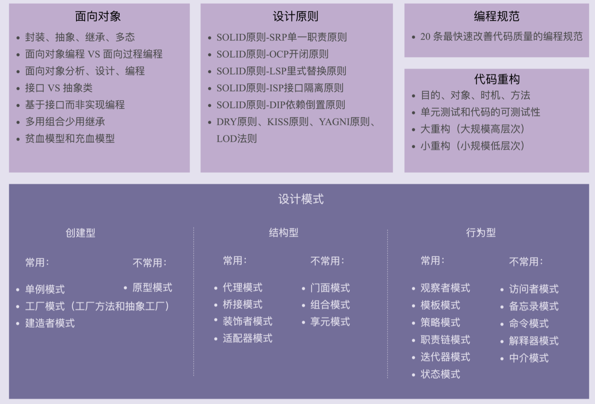

##### **UML** 

- 在互联网公司的项目开发中，用处并不大。为了文档化软件设计或者方便讨论软件设计，大部分情况下，我们随手画个不那么规范的草图，能够达意，方便沟通就够了，而完全按照 UML 规范来将草图标准化，所付出的代价是不值得 的。

##### **面向对象 VS 面向过程**

- 对于大规模复杂程序的开发来说，整个程序的处理流程错综复杂，并非只有一条主线。如 果把整个程序的处理流程画出来的话，会是一个**网状结构**。如果我们再用面向过程编程这种 流程化、线性的思维方式，去翻译这个网状结构，去思考如何把程序拆解为一组顺序执行的 方法，就会比较吃力。这个时候，面向对象的编程风格的优势就比较明显了。 面向对象则是进行业务建模，将函数封装成类，类之间的交互关系更易于维护扩展。封装=易维护性,抽象、继承、多态=可复用性|可扩展性 
  
- 面向对象编程是以类为思考对象。在进行面向对象编程的时候，我们并不是一上来就去思 考，如何将复杂的流程拆解为一个一个方法，而是采用曲线救国的策略，先去思考如何给业 务建模，如何将需求翻译为类，如何给类之间建立交互关系，而完成这些工作完全不需要考 虑错综复杂的处理流程。当我们有了类的设计之后，然后再像搭积木一样，按照处理流程， 将类组装起来形成整个程序。

##### **抽象意识、接口意识、封装意识** 

- 时刻具备这些意识，识别出代码可变部分和不可变部分**之后，将可变部分封装起来，隔离变化， 提供抽象化的不可变接口，给上层系统使用，代码的**扩展性**。(提高代码扩展性的方法有：多态、依赖注入、基于接口而非实现编 程，以及大部分的设计模式（比如，装饰、策略、模板、职责链、状态）。) 在定义接口的时候，不要暴露任何实现细节。接口的定义只表明做什么，而不是怎么做。 函数的命名不能暴露任何实现细节。比如uploadToAliyun() 就不符合要 求，应该改为去掉 aliyun 这样的字眼，改为更加抽象的命名方式，比如：upload(); 

##### **继承 VS 组合、接口、委托**

> 如果类之间的继承结构稳定（不会轻易改变），继承层次比较浅（比如，最多有两层继承关 系），继承关系不复杂，我们就可以大胆地使用继承。反之，系统越不稳定，继承层次很 深，继承关系复杂，我们就尽量使用组合来替代继承。除此之外，还有一些设计模式会固定使用继承或者组合。比如，装饰者模式（decorator pattern）、策略模式（strategy pattern）、组合模式（composite pattern）等都使用了 组合关系，而模板模式（template pattern）使用了继承关系。GO完全摒弃了继承，在语法上只有组合，接口之间也可以组合(这也是官方鼓励的做法)。

##### **设计原则**
- **SRP**

  先写一个粗粒度的类，满足业务需求。随着业务的发展，如果粗粒度的类越来越庞大，代码越来越多，这个时候，我们就可以 将这个粗粒度的类，拆分成几个更细粒度的类。单一职责原则通过避免设计大而全的类，避免将不相关的功能耦合在一起，来提高类的内聚 性。同时，类职责单一，类依赖的和被依赖的其他类也会变少，减少了代码的耦合性，以此 来实现代码的高内聚、低耦合。但是，如果拆分得过细，实际上会适得其反，反倒会降低内 聚性，也会影响代码的可维护性。

- **里式替换原则**（ Liskov Substitution Principle）Design By Contract

  子类的设计要保证在替换父类的时候，不改变原有程序的逻辑及不破坏原有程序的正确性。

- **接口隔离原则**

  接口隔离，拆分开来满足正交性原则。ex：用户操作接口为UserService接口，针对删除用户功能提供RestrictedUserService 接口，后者只打包提供给后台管理系统来使用。热更新定义updater接口，查看配置定义viewer接口。

- **迪米特法则 The Least Knowledge Principle.**  Each unit should have only limited knowledge about other units: only units “closely” related to the current unit. Or: Each unit should only talk to its friends; Don’t talk to strangers.
  
- **KISS**--------Keep It Simple and Stupid.尽量保持简单
  
- **YAGNI**-----You Ain’t Gonna Need It.不需要的就不要做
  
- **DRY**--------Don’t Repeat Yourself.（第一次编写代码的时候，我们不考虑复用性；第二次遇到复用场景的时候，再进 行重构使其复用。）

##### **框架设计**

  > 画产品线框图=>聚焦简单应用场景=>设计实现最小原型=>画系统设计图

  > 使用测试驱动：先具体到一个小的场景看怎么实现这个框架, 把所有代码都塞到一个类中，暂时不用考虑任何代码质量、 线程安全、性能、扩展性等等问题，怎么简单怎么来就行。

  

##### **单元测试设计**

  > 写单元测试本身不需要什么高深技术。它更多的是考验程序员思维的缜密程度，看 能否设计出覆盖各种正常及异常情况的测试用例，来保证代码在任何预期或非预期的情况下 都能正确运行。

  >  编写完善的单元测试。得益于此，我写的代码几乎是 bug free 的。这也节省了我很多 fix 低级 bug 的时间，能够有时间去做其他更有意义的事情。程序运行的 bug 往往出现在一些边界条件、异常情况下，比如，除数未判空、网络超时。**设计完整覆盖各种边界条件的测试用例。**

  > 大部分程序员写 的代码很难做到“不言自明”。在没有文档和注释的情况下，单元测试就起了替代性作 用。单元测试用例实际上就是用户用例，反映了代码的功能和如何使用。借助单元测试，我 们不需要深入的阅读代码，便能知道代码实现了什么功能，有哪些特殊情况需要考虑，有哪 些边界条件需要处理。

  >将覆盖率作为衡量单元测试质量的唯一标准是不合理的。 实际上，更重要的是要看测试用例是否覆盖了所有可能的情况，特别是一些 corner case，过度关注单元测试的覆盖率会导致开发人员为了提高覆盖率，写很多没有必要的测 试代码，比如 get、set 方法非常简单，没有必要测试。一个项目的 单元测试覆盖率在 60～70% 即可上线。如果项目对代码质量要求比较高，可以适当提高单 元测试覆盖率的要求。

  **测试不友好的代码:**

  > 代码中包含未决行为逻辑

  > 滥用可变全局变量

  > 滥用静态方法

  > 使用复杂的继承关系

  > 高度耦合的代码

##### 编程规范

  > 作用域比较小的变量，我们可以使用相对短的命名，比如一些函数内的临时变量。相反，对于类名这种作用域比较大的，我更推荐用长的命 名方式。
  >
  > 函数的代码行数不要超过一屏幕的大小，比如 50 行。类的大小限制比较难确定。
  >
  > 不要使用boolean控制逻辑，违反单一职责|接口隔离原则，最好拆成两个函数

##### npe|Exception

  > 尽管返回 NULL 值有诸多弊端，但对于以 get、find、select、search、 query 等单词开头的查找函数来说，数据不存在，并非一种异常情况，这是一种正常行 为。所以，返回代表不存在语义的 NULL 值比返回异常更加合理。

  > 返回空字符串和空集合，可使调用者避免NPE

  > public|protected需要对参数做null判断，private不需要（在你控制范围内）

  > C++ 和大部分的动态语言（Python、Ruby、 JavaScript 等）都只定义了一种异常类型：运行时异常（Runtime Exception）。而像 Java，除了运行时异常外，还定义了另外一种异常类型：编译时异常（Compile Exception）。对于代码 bug（比如数组越界）以及不可恢复异常（比如数据库连接失败），即便我们捕 获了，也做不了太多事情，所以，我们倾向于使用非受检异常。对于可恢复异常、业务异 常，比如提现金额大于余额的异常，我们更倾向于使用受检异常，明确告知调用者需要捕获 处理。

  > 是否往上继续抛出，要看上层代码是否关心这个异常。关心就将它抛出，否则就直接 吞掉。是否需要包装成新的异常抛出，看上层代码是否能理解这个异常、是否业务相关。如 果能理解、业务相关就可以直接抛出，否则就封装成新的异常抛出。

### Design Pattern

> 设计模式要干的事情就 是解耦。创建型模式是将创建和使用代码解耦，结构型模式是将不同功能代码解耦，行为型 模式是将不同的行为代码解耦。

#### 创建型设计模式----对象的创建

>创建型模式主要解决对象的创建问题，封装复杂的创建过程，解耦对象的创建代码和使用代码。
>
>其中，单例模式用来创建全局唯一的对象。工厂模式用来创建不同但是相关类型的对象（继 承同一父类或者接口的一组子类），由给定的参数来决定创建哪种类型的对象。建造者模式 是用来创建复杂对象，可以通过设置不同的可选参数，“定制化”地创建不同的对象。原型 模式针对创建成本比较大的对象，利用对已有对象进行复制的方式进行创建，以达到节省创 建时间的目的。

##### 单例 singleton

>设计：静态内部类|枚举|双重检查
>
>缺陷：扩展性不好（eg：慢sql|其他sql需要设计成分开的独立数据库连接池实例）
>
>EXT: 线程唯一（ThreadLocal）-》进程唯一 -》集群唯一
>

##### 工厂 factory

  > <创建对象复杂度> new-》简单工厂-》工厂-》抽象工厂

  > ===》DI容器：（配置解析|对象创建|生命周期管理）
  >
  > （每种类设计工厂太复杂因此使用BeansFactory管理所有类对象的反射创建)

##### 建造者 builder

  > <构造对象参数个数|参数依赖关系复杂度> 构造器传参==>连续调set属性==>builder
  >
  > 适用场景：创建时对参数集中校验|创建不可变对象|
  >
  > vs工厂：factory创建不同类型的对象，builder根据参数创建同一类对象
##### 原型 prototype

  > 拷贝已有对象的数据，更新少量差值
  >
  > 适用场景：对象创建成本比较大（排序|哈希计算|RPC网络文件流读取等）
  >
  > object.clone()仅拷贝内存地址（浅拷贝，会共享数据）不常用  
  >
  > 深拷贝需要序列化|递归拷贝属性

#### 结构型设计模式---类或对象的组合或组装

- 代理模式：代理模式在不改变原始类接口的条件下，为原始类定义一个代理类，主要目的是 控制访问，而非加强功能，这是它跟装饰器模式最大的不同。
- 桥接模式：桥接模式的目的是将接口部分和实现部分分离，从而让它们可以较为容易、也相 对独立地加以改变。
- 装饰器模式：装饰者模式在不改变原始类接口的情况下，对原始类功能进行增强，并且支持 多个装饰器的嵌套使用。
- 适配器模式：适配器模式是一种事后的补救策略。适配器提供跟原始类不同的接口，而代理 模式、装饰器模式提供的都是跟原始类相同的接口。

##### 代理 proxy

> 适用场景：监控、 统计、鉴权、限流、事务、幂等、日志、缓存、RPC

##### 桥接 bridge

> Decouple an abstraction from its implementation so that the two can vary independently。
>
> 一个类存在两个（或多个） 独立变化的维度，我们通过组合的方式，让这两个（或多个）维度可以独立进行扩展。类与类之间的组合关系。
>
> eg：jdbc驱动加载过程

##### 装饰 decorate

> VS代理: 代理类附加 的是跟原始类无关的功能，而装饰器类附加的是跟原始类相关的增强功能。
> 
##### 适配 adaptor

> 适用场景：接口不兼容，是设计缺陷的补偿

##### 门面 facade

> 适用场景：设计细粒度接口（为了复用性）和易用性（不必频繁调用多个接口）之间的一个取舍

> eg: 易用性：内核调用 》 系统调用 》shell命令  性能：多个接口调用换成一个调用

##### 组合 comoposite

> 树+递归：将单个对象和组合对象都看做树中的节点，以统一处理逻辑，并且它利用树形结构的特点，递归地处理每个子树

##### 享元 flyweight--预热？

> 通过工厂类来“缓存”已经创建好的对象

> vs单例、缓存、对象池|连接池|线程池：应用单例模式是为了保证对象全局唯 一。应用享元模式是为了实现对象复用，节省内存。缓存是为了提高访问效率，而非复用。 池化技术中的“复用”理解为“重复使用”，主要是为了节省时间。

> 适用场景：优化内存占用

> eg1：棋盘只保存棋子的位置信息，不同棋盘共享一个map容器中的30个棋子。
> eg2:  Integer 、Long、Short、Byte对象的值在 -128 到 127 之间会从 IntegerCache等类中加载。
> eg3：字符串常量池

> 缺陷:  享元模式对 JVM 的垃圾回收并不友好。因为享元工厂类一直保存了对享元对象的 引用，这就导致享元对象在没有任何代码使用的情况下，也并不会被 JVM 垃圾回收机制自 动回收掉。因此，在某些情况下，如果对象的生命周期很短，也不会被密集使用，利用享元 模式反倒可能会浪费更多的内存。所以，除非经过线上验证，利用享元模式真的可以大大节 省内存，否则，就不要过度使用这个模式，为了一点点内存的节省而引入一个复杂的设计模 式，得不偿失啊。

#### 结构型设计模式----类或对象之间的交互（11/23 占比最大的设计模式类型）

##### 观察者 Observer|publish-subscribe

> Define a one-to-many dependency between objects so that when one object changes state, all its dependents are notified and updated automatically.

> 异步非阻塞|同步阻塞

> 观察者模式将观察者和被观察者代码解耦

> EventBus框架：
>
> 框架的作用有：隐藏实现细节，降低开发难度，做到代码复用，解耦业务与非业 务代码，
>
> 针对异步非阻塞观察者模式，我们也可以将它抽象成框架 来达到这样的效果

##### 模板方法 Template Method

> Define the skeleton of an algorithm in an operation, deferring some steps to subclasses. Template Method lets subclasses redefine certain steps of an algorithm without changing the algorithm’s structure.

> 模板abstract（继承） VS回调callback | hook函数（组合） ：回调相对于模板 模式会更加灵活

##### 策略 Strategy -- interchangeable encapsulated family of algorithms

> Define a family of algorithms, encapsulate each one, and make them interchangeable. Strategy lets the algorithm vary independently from clients that use it.

> Usage：1.配置文件中配置具体策略     2.注解+反射生成具体策略避免策略工厂类

##### 职责链 Chain Of Responsibility

> Avoid coupling the sender of a request to its receiver by giving more than one object a chance to handle the request.
>
> 一般配合模板方法模式 
>
> Usage: 链表（每个节点保存下一个节点） vs 数组（遍历循环）

##### 状态机 Finite State Machine  FSM

> Usage: 1.分支逻辑 2.表驱动 3.状态模式

##### 迭代器 Iterator | Cursor

> 配合容器使用：容器+容器对应的迭代器

> 使用场景（vs for循环）：
>
> 1.封装拆分对树和图的复杂遍历算法比如 DFSIterator、BFSIterator
>
> 2.针对一个容器可以有不同的迭代器维护不同的游标位置同时遍历而互不影响

> 遍历同时增删元素解决方案：
>
> 1.遍历的时候不允许增删元素 》无法确定遍历结束时间点（增加finish方法需要手动调用）
>
> 2.增删元素之后让遍历报错：（增加modCount变量）

##### 访问者 vistor

> Allows for one or more operation to be applied to a set of objects at runtime, decoupling the operations from the object structure.

> 场景：解决java不支持Double Dispatch ，实现类中accept接口 而非多态重载（报错）

> VS工厂：	访问者模式需要定义的类要比工厂 模式的实现方式少很多，类太多也会影响到代码的可维护性。

##### 备忘录 Memo | Snapshot

> Captures and externalizes an object’s internal state so that it can be restored later, all without violating encapsulation.

> 优化内存|时间消耗：低频全量备份+高频增量备份

##### 命令 Command

> The command pattern encapsulates a request as an object, thereby letting us parameterize other objects with different requests, queue or log requests, and support undoable operations.

> Usage: 将函数封装成对象。对象就可以存储下来，方便控制执行。所以，命令模式的主 要作用和应用场景，是用来控制命令的执行，比如，异步、延迟、排队执行命令、撤销重做 命令、存储命令、给命令记录日志等等，这才是命令模式能发挥独一无二作用的地方。

#####  解释器 Interpreter

> Interpreter pattern is used to defines a grammatical representation for a language and provides an interpreter to deal with this grammar.

##### 中介 Mediator

> Mediator pattern defines a separate (mediator) object that encapsulates the interaction between a set of objects and the objects delegate their interaction to a mediator object instead of interacting with each other directly
>
> 将一组对象之间的交互关系 （或者依赖关系）从多对多（网状关系）转换为一对多（星状关系）。Usage:参与者之间的交互关系错综复杂，维护成本很高

