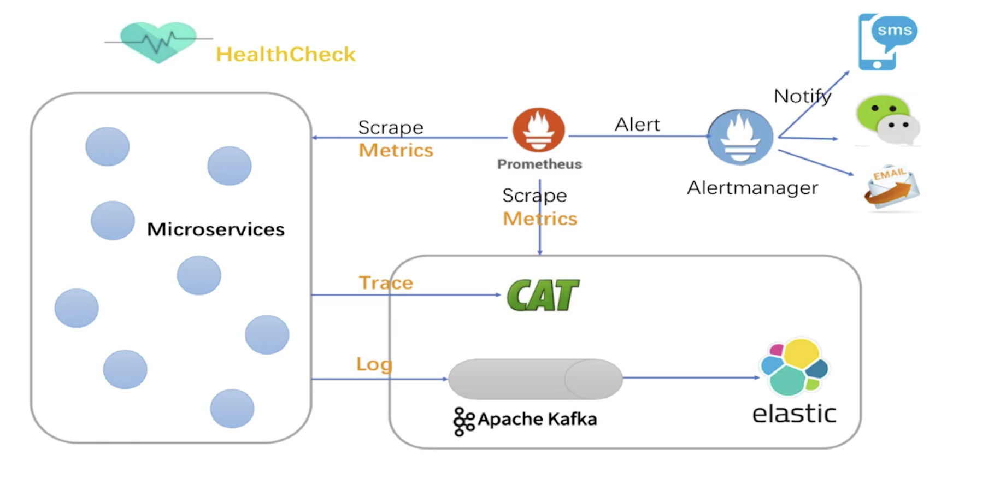
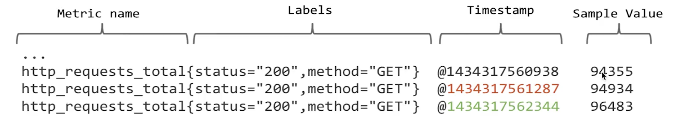
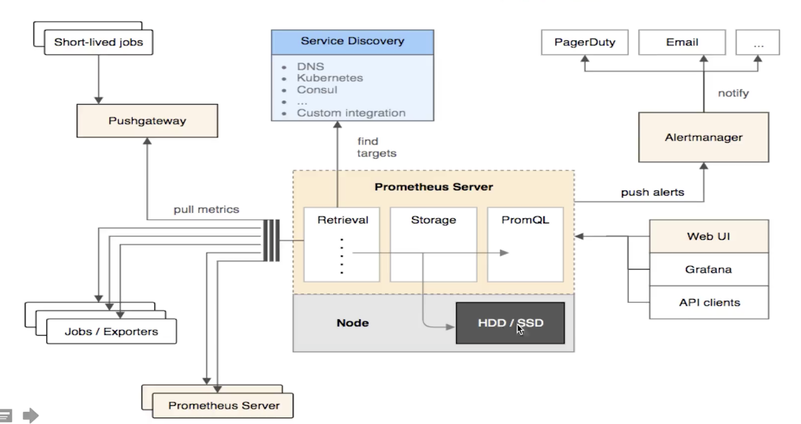

### 监控分类

- 端监控：用户端web、app页面打开速度、页面稳定性、外部服务调用成功率
- 业务层监控: 用户访问QPS、应用日活、转化率、登录数、订单数、搜索次数等
- 应用层监控；分布式应用进行性能、调用链、jvm、springboot、dubbo调用等
- 中间件监控：框架埋点、延迟、错误率、mq、redis、tomcat、jetty
- 系统监控：cpu、内存、ss统计、dns解析、交换机、路由器、防火墙、vpn、丢包率

### Prometheus

#### 特点

- MDD（Metrics Driven Development）
- 拉模式实现
- 多维度（任意打tag组合）
- 黑盒（外部http、tcp探针）
- 白盒（对监控指标观察）

#### 数据模型

#### 架构

