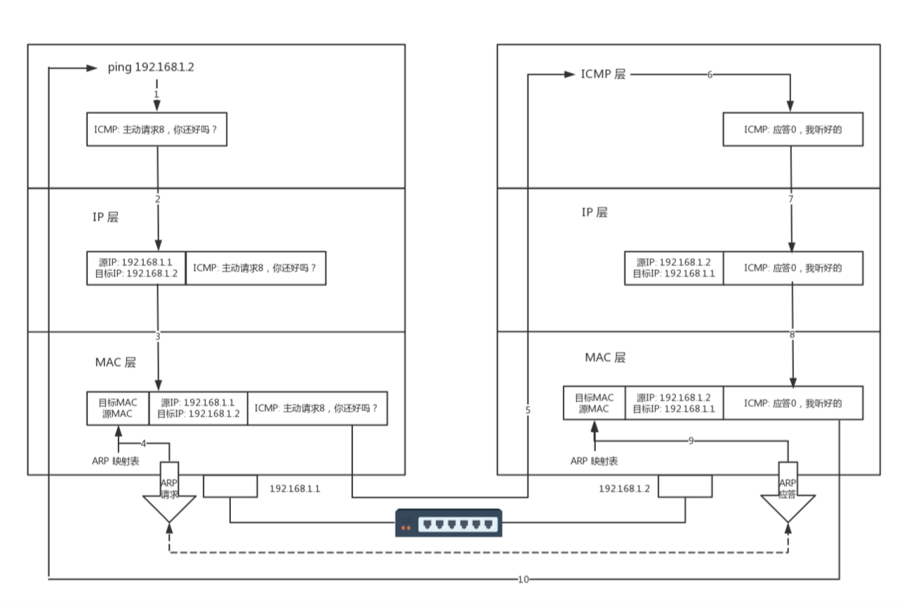

###基础概念

网络为什么要分层？***复杂的程序都要分层，这是程序设计的要求。**只要是在网络上跑的包，都是完整的。可以有下层没上层，绝对不可能有上层没下 层。对TCP协议来说，三次握手也好，重试也好，只要想发出去包，就要有IP层和MAC层，不然是 发不出去的。

**IP是地址，有定位功能；MAC是身份证，无定位功能；**私有IP地址段可以自己分配，公有IP地址有个组织统一分配。CIDR可以用来判断是不是本地人；

**MAC地址更像是身份证，是一个唯一的标识。**MAC地址号称全局唯一，不会有两个网卡有相同 的MAC地址，而且网卡自生产出来，就带着这个地址.它设计是为区分主机，主要目的不是为了定位。

MAC地址的通信范围比较小，局限在一个子网里面。例如，从192.168.0.2/24访 问192.168.0.3/24是可以用MAC地址的。一旦跨子网，即从192.168.0.2/24到192.168.1.2/24，MAC地址就不行了，需要IP地址起作用了。

Linux首先会判断，要去的这个地址和我是一个网段的吗，或者和我的一个网卡是同一网段 的吗？只有是一个网段的，它才会发送ARP请求，获取MAC地址。如果发现不是则发送给网关

**MTU**是二层MAC层的概念。MAC层有MAC的头，以太网规定连MAC头带正文合起来，不允许超过1500个字节。正文里面有IP的头、TCP的头、HTTP的头。如果放 不下，就需要分片来传输。

同一个网段可以使用mac地址通信，跨网段就需要IP协议通信了。

###**分层**

- 一层：物理层(Hub的东西，也就是集线器。无脑复制到其他端口，有包冲突、浪费流量)

- 二层：MAC地址（交换机是二层设备）数据链路层(MAC层）（在局域网LAN） 解决问题：

  这个包是发给谁的？谁应该接收？=>链路层地址(MAC地址)

  仅知道IP地址？=>**ARP协议**发送广播包，根据IP求MAC地址（本地有ARP缓存，不必每次广播）

  先发后发规则?=>(类似车辆管控-》信道划分|轮流协议|**随机接入协议**)

  发送错误？=>CRC循环冗余检测

  **交换机**=》类似总线负责从数据包拿下来mac头后看看发送到对应网口, 包迷路-》STP协议环变树

- 三层：IP地址

- 四层：端口号

ping查询报文，Traceroute 差错报文。（基于ICMP协议）

- 如果是同一个网段，例如，你访问你旁边的兄弟的电脑，那就没网关什么事情，直接将源地址和目标地 址放入IP头中，然后通过ARP获得MAC地址，将源MAC和目的MAC放入MAC头中，发出去就可以了。

- 如果不是同一网段，例如，你要访问你们校园网里面的BBS，该怎么办？这就需要发往默认网 关Gateway。Gateway的地址一定是和源IP地址是一个网段的。往往不是第一个，就是第二个。例 如192.168.1.0/24这个网段，Gateway往往会是192.168.1.1/24或者192.168.1.2/24。

如何发往默认网关呢？网关不是和源IP地址是一个网段的么？这个过程就和发往同一个网段的其他机器 是一样的：将源地址和目标IP地址放入IP头中，通过ARP获得网关的MAC地址，将源MAC和网关 的MAC放入MAC头中，发送出去。网关所在的端口，例如192.168.1.1/24将网络包收进来，然后接下来 怎么做，就完全看网关的了。

网关往往是一个路由器，是一个三层转发的设备。啥叫三层设备？前面也说过了，就是把MAC头和IP头 都取下来，然后根据里面的内容，看看接下来把包往哪里转发的设备。

在你的宿舍里面，网关就是你宿舍长的电脑。一个路由器往往有多个网口，如果是一台服务器做这个事 情，则就有多个网卡，其中一个网卡是和源IP同网段的。

很多情况下，人们把网关就叫作路由器。其实不完全准确，而另一种比喻更加恰当：路由器是一台设 备，它有五个网口或者网卡，相当于有五只手，分别连着五个局域网。每只手的IP地址都和局域网 的IP地址相同的网段，每只手都是它握住的那个局域网的网关。任何一个想发往其他局域网的包，都会到达其中一只手，被拿进来，拿下MAC头和IP头，看看，根据自 己的路由算法，选择另一只手，加上IP头和MAC头，然后扔出去。

- 当交换机的数目越来越多的时候，会遭遇环路问题，让网络包迷路，这就需要使用STP协议，通过华 山论剑比武的方式，将有环路的图变成没有环路的树，从而解决环路问题。 
- 交换机数目多会面临隔离问题，可以通过VLAN形成虚拟局域网，从而解决广播问题和安全问题。（只需要在原来的二层的头上加一个TAG，里面有一个VLAN ID，一共12位。，如果我们买的交换机是支持VLAN的，当这个交换机把二层的头取下来的时候，就能够识别这个VLAN ID。这样只有相同VLAN的包，才会互相转发，不同VLAN的包，是看不到的。这样广播问题和安全问 题就都能够解决了。）

**路由表   ** 

命令：route

- 静态路由
- 动态路由

**VPN是如何工作的？**

VPN通过隧道技术在公众网络上仿真一条点到点的专线，是通过利用一种协议来传输另外一种协议的技 术，这里面涉及三种协议：乘客协议、隧道协议和承载协议。

https://mubu.com/doc/1cZYndRrAg

### 实验

