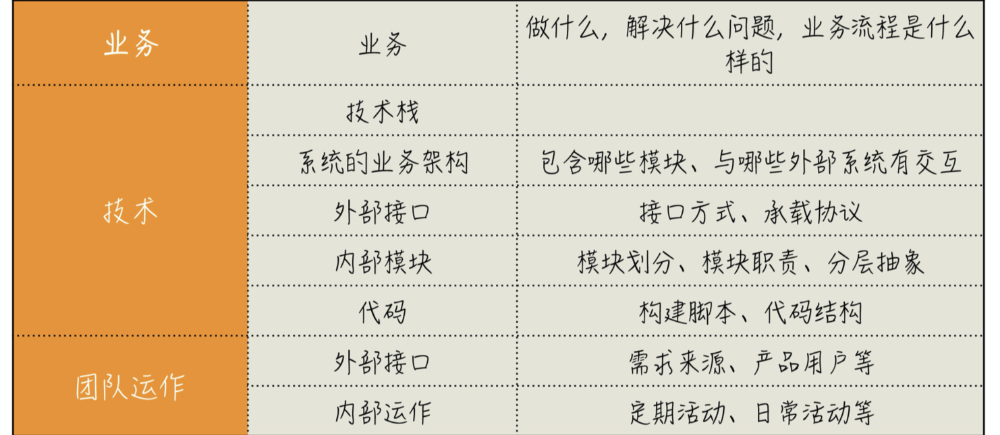

**关于沟通：**我们要多问问题，⽬的就是为了不做那些不该做的事。

**把函数写短：** 能看到多⼩，就可以在多细的粒度上⼯作。单⼀职责这件事举个例⼦很容易，但在真实的⼯作场景中，你能看到⼀个模块在为多少 actor 服务，就完全取决于你的分解能⼒了。我⾃⼰的习惯⽽⾔，通常的函数都在⼗⾏以内，如果是表达能⼒很强的语⾔，⽐如 Ruby，函数会更短。

**设计：**在软件开发中，框架、工具之类的东⻄都是易变的，唯有设计的可变性是你可以控制的。

**有关抽象：**分层架构，实际上，就是⼀种在设计上的分解。在软件开发中，分层⼏乎是⽆处不在的，因为好的分 层往往需要有好的抽象。⽹络模型的分层架构实现得太好了，好到你作为上层的使 ⽤者⼏乎可以忽略底层。⽽这正是分层真正的价值：构建⼀个良好的抽象。编程语⾔也是⼀种抽象。Node.js 的出现让 JavaScript 成为了⼀个更好的抽象。

**DDD:**构建抽象，最核⼼的⼀步是构建出你的核⼼模型。即是MVC三层架构中的服务层。你的领域层只依赖于你的领域对象，第三⽅发过来的内容先做⼀次转换，转换成你 的领域对象。这种做法称为防腐层。，已经构建好的领域模型怎么更好地提供给其他部分使⽤呢？⼀个好的做法是封装成领域特定语 ⾔（Domain Specific Language，DSL）。 限界上下⽂限定了通⽤语⾔⾃由使⽤的边界，⼀旦出界，含义便⽆法保证。正是由于边界的存在，⼀个限界上下⽂刚好可以成为⼀个独⽴的部署单元，⽽这个部署单元就可以成为⼀个服务。先⽤分模块的⽅式在⼀个⼯程内，让服务先演化⼀段时间，等到真的觉得某个模块可以“毕业”了，再去开启微服务之旅。（DDD学习：《领域驱动设计精粹》（其他书复杂不好懂，概念模糊，深究没必要））

**了解公司：**业务模式-》技术栈-》系统对外接口/能力（REST|RPC|MQ->JSON|XML|BYTE）-》内部模块分层结构

-摘自《10x程序员工作法》

**T字型人才**：我在⾯试时会问候选⼈这样⼀个问题：“如果让你在⼀次技术⼤会上做分享，你会讲什么呢？”我真正的问题是，以⾏业 标准衡量，你觉得你在哪个⽅⾯是专家呢？要有自己的深度思考，专研方向。学习微积分是有难 度，但同发明微积分相⽐，难度根本不在⼀个层次上。

**提高：**怎么才能让⾃⼰的⽔平不断提⾼呢？我的答案是，找⼀个好问题去解决，解决了⼀个好的问题能够 让你的⽔平快速得到提升。什么是好问题？就是⽐你当前能⼒略⾼⼀点的问题，⽐如：如果你还什么都不会，那有⼀份编程的⼯作就好。 如果你已经能够写好普通的代码，就应该尝试去编写程序库。 如果实现⼀个具体功能都没问题了，那就去做设计，让程序有更好的组织。 如果你已经能完成⼀个普通的系统设计，那就应该去设计业务量更⼤的系统。

**关注时间颗粒度**